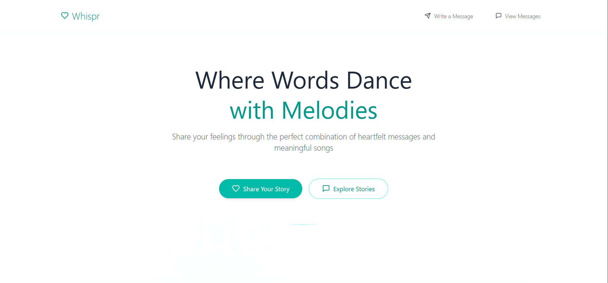
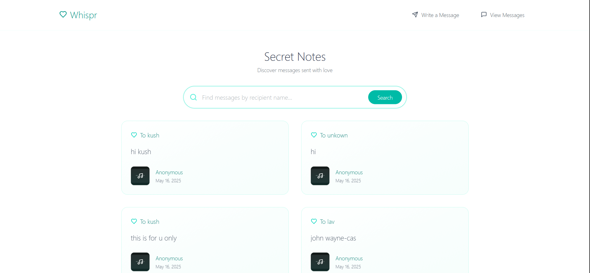

# Whispr GraphQL Project

A full-stack GraphQL application with a React frontend and Apollo Server backend.Where  Users can send anonymous messages along with their favorite songs, creating a fun and engaging experience

## Features

- Apollo Server GraphQL backend connected to MongoDB for fast and reliable data handling
- React frontend with Apollo Client for smooth GraphQL queries and mutations
- Users can send anonymous messages along with their favorite songs, creating a fun and engaging experience
- Beautiful and responsive UI design for an intuitive and enjoyable user experience
- CORS configured to work seamlessly in both local development and production environments
- Environment variables manage backend and frontend URLs for easy configuration
- Backend deployed on Render and frontend on Vercel for scalable, production-ready hosting
- GraphQL API available at the `/graphql` endpoint for efficient data communication

## Technologies Used

- Node.js, Express, Apollo Server (GraphQL)
- React, Vite, React Router, Apollo Client
- MongoDB (with Mongoose)
- Deployment on Render (backend) and Vercel (frontend)

## Getting Started

### Prerequisites

- Node.js (v16 or higher recommended)
- MongoDB instance (local or cloud)
- Vercel or Render account for deployment (optional)

### Backend Setup

1. Clone the repo and navigate to the backend folder:

   
   cd server
2. Install dependencies:
npm install

3. Create a .env file in the backend root and add:
PORT=4000
MONGODB_URI=your_mongodb_connection_string
FRONTEND_URL=http://localhost:5173
PRODUCTION_FRONTEND_URL=https://your-frontend.vercel.app

4. Start the backend server locally:
npm run dev

### Frontend Setup
1. Navigate to the frontend folder:
cd client
2. Install dependencies:
npm install
3. Create a .env file in the frontend root and add:
VITE_BACKEND_URL=http://localhost:4000/graphql
4. Start the frontend app:
npm run dev
5. Open your browser to http://localhost:5173

Deployment
Backend deployed on Render 

Frontend deployed on Vercel 

Update environment variables accordingly to reflect the deployed URLs.

Notes on CORS
Backend CORS settings allow both local and production frontend URLs:

const allowedOrigins = [
  process.env.FRONTEND_URL,
  process.env.PRODUCTION_FRONTEND_URL,
];
Make sure to update these values in your backend .env file.

License
MIT License

